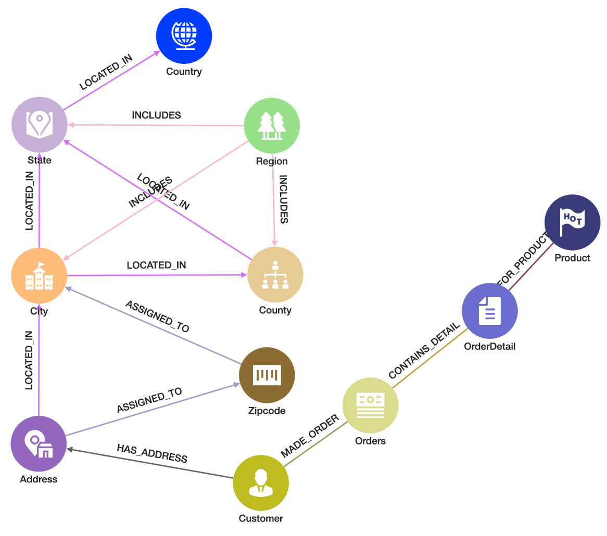

# Graph Schema

To view your graph schema, you will want to go to the "Schema View" menu.

[TigerGraph Cloud Studio Schema View](https://tools.tgcloud.io/studio/#/home)

## Schema Views

### In the Global View

### In the Graph Database View

Our C360 Demo schema has the following vertex types

1. Address
1. City
3. Country
2. County
2. Customer
3. Orders
4. OrderDetail
4. Product
9. State
5. Zipcode

Note that all the vertex types are singular with the exception of the "Orders".  This is to avoid confusion with the ORDER keyword.

Note that we have not modeled Product Categories or Suppliers but this might be the logical next step.